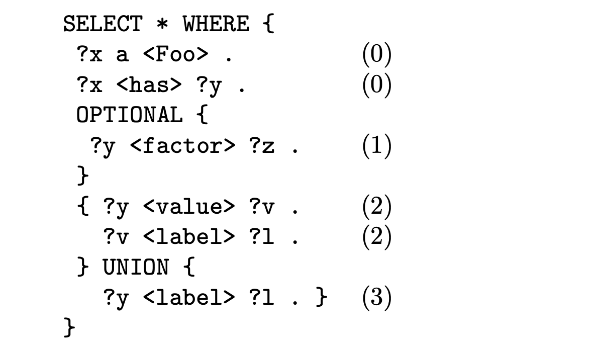
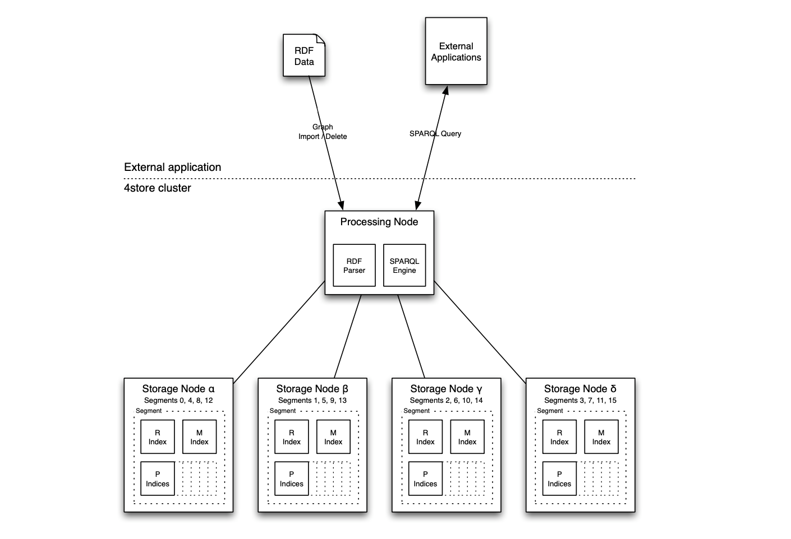

# 4store
## История создания и развития СУБД:
Необходимость в хранилище возникла из фундаментальных бизнес-требований в Garlic. 4store был разработан в первую очередь для обеспечения внутреннего хранилища для DataPatrol1 от Garlik, продукта для защиты личной информации, ориентированного на потребителя. 

4 store был реализован на недорогом сетевом кластере со многими десятками серверов, поддерживающих работу 24x7. Кроме того, компания Garlic создала семантически обоснованное программное обеспечение для поиска и сбора данных и использовала технологии разработки языка промышленного уровня для многих миллионов веб-страниц, ориентированных на людей. Были разработаны методы извлечения информации из структурированных и полуструктурированных баз данных. Эта информация организована в соответствии с облегченной онтологией, ориентированной на людей, которая при импорте содержит много миллиардов троек RDF.

## Инструменты для взаимодействия с СУБД
Инструментами взаимодействия являются RDF parser Raptor либо Rasqal (SPARQL parser)

## Database engine
На момент первоначального проектирования было неэкономично приобретать компьютеры с достаточным объемом оперативной памяти для хранения соответствующей доли индекса RDF для прогнозируемого объема данных. Было подсчитано, что разумный средний объем памяти для четырехъядерного устройства составляет около 100 байт, что означает, что для хранения полного индекса потребуется 93 ГБ оперативной памяти. В результате было решено использовать методологию кластерного хранения.
По соображениям экономической эффективности было решено основать кластер на 64-разрядном многоядерном оборудовании x86, работающем под управлением операционной системы Linux. В то время считалось, что это обеспечивает наилучшее соотношение цены и производительности и обеспечивает доступ к большому количеству квалифицированных администраторов и системных программистов. Связь должна была обеспечиваться контроллерами и коммутаторами сетевого интерфейса Gigabit Ethernet.

## Queries architecture:
Запросы во многом основываются на реляционной алгебре и выглядят следующим образом:

## Распределение файлов БД
4store’s cluster topology:

Данные разделены на несколько сегментов (неперекрывающиеся фрагменты данных), с одним или несколькими сегментами на каждом узле хранения, как показано на рисунке. Эти узлы делятся на узлы обработки и хранения.
Также возможно запустить 4 хранилища на одном узле, запустив интерфейс обработки и один или несколько внутренних интерфейсов хранилища на одной машине. 4 хранилище получает мало преимуществ от близости, и по-прежнему возникают накладные расходы на TCP-связь между компонентами обработки и хранения.

СУБД написана практически полностью на си, не считая фронтенд инструменты которые написаны на html

4 store использует анализатор Rasqal SPARQL. Rasqal создает дерево синтаксического анализа, представляющее базовую структуру выражения SPARQL. 4store обходит это дерево в поисках вхождений переменных, которые он записывает как метаданные, и помечает блоки шаблонов привязки идентификаторами.

Было обнаружено, что явные транзакции не являются необходимыми, поэтому это требование было снято

4store является open-source и поддерживается в гитхабе непосредственными создателями этой СУБД на их [гитхабе](https://github.com/4store/4store)
Права на коммит имеет группа энтузиастов из 24 человек

Найти документацию и быть в курсе происходящего можно также в том же [гитхабе](https://github.com/4store/4store) проекта.

